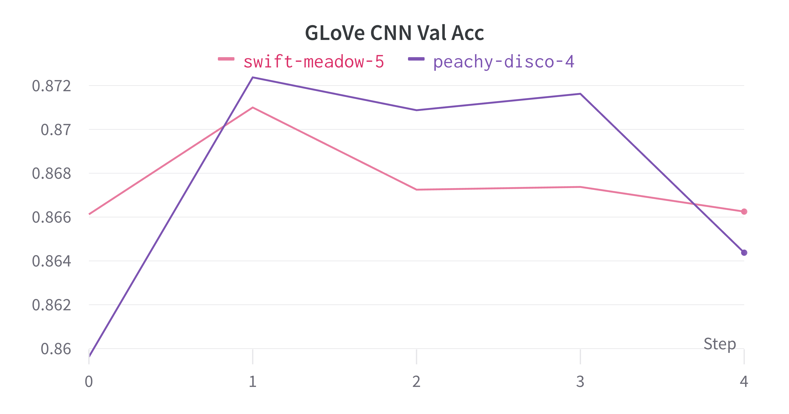

# Link

WandB: https://wandb.ai/arth-shukla/IMDB%20Sentiment%20Analysis

# Resources Used

The purpose of this project was to test fine-tuning word embeddings using Gensim for simpler nlp models (CNN and LSTM).

For problem context (data and motivation), I used this toy problem: https://github.com/skillcate/sentiment-analysis-with-deep-neural-networks

# Technologies Used

Architectures/Tools: LSTMs, CNNs, GLoVe Embeddings

AI Development Keras, Gensim, GLoVe, Cuda, WandB

# Evaluation and Inference

More Figures available on WandB: https://wandb.ai/arth-shukla/IMDB%20Sentiment%20Analysis

First, we study Validation accuracy for CNNs and LSTMs. The dataset was fairly balanced, so accuracy is an okay metric. We find minimal difference in validation accuracy behaviors, and the end results are relatively close. This is likely due to the simpler data and smaller size of the dataset.

<table>
    <tr>
        <td></td>
        <td></td>
    </tr>
    <tr>
        <td></td>
        <td></td>
    </tr>
</table>

The losses tell a similar story. Embedding type did not make much of a difference in how the models trained the data.

<table>
    <tr>
        <td></td>
        <td></td>
    </tr>
    <tr>
        <td></td>
        <td></td>
    </tr>
</table>

# Future Experiments

I'd like to try out a more specialized terminology. In this case, my suspicion is that the word embeddings fitted directly to the data will be far less generalizable. Scientific papers or older texts might fit this well.

# About Me

Arth Shukla [Site](https://arth.website) | [GitHub](https://github.com/arth-shukla) | [LinkedIn](https://www.linkedin.com/in/arth-shukla/)
